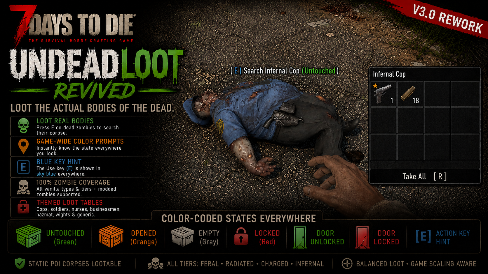
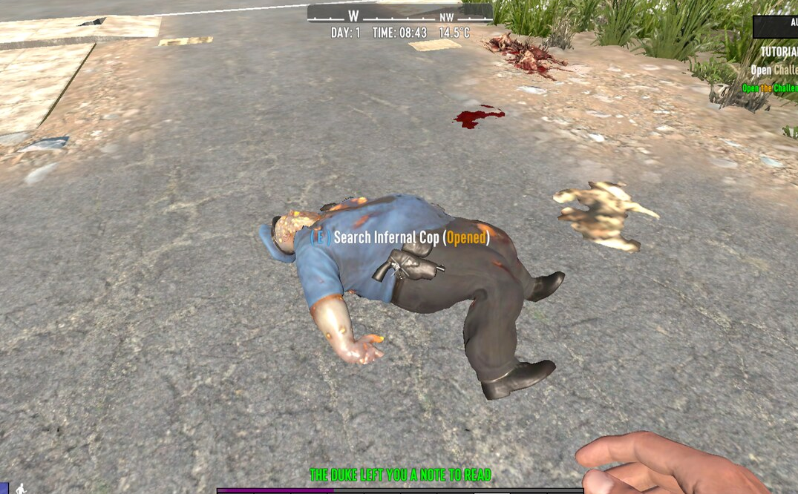
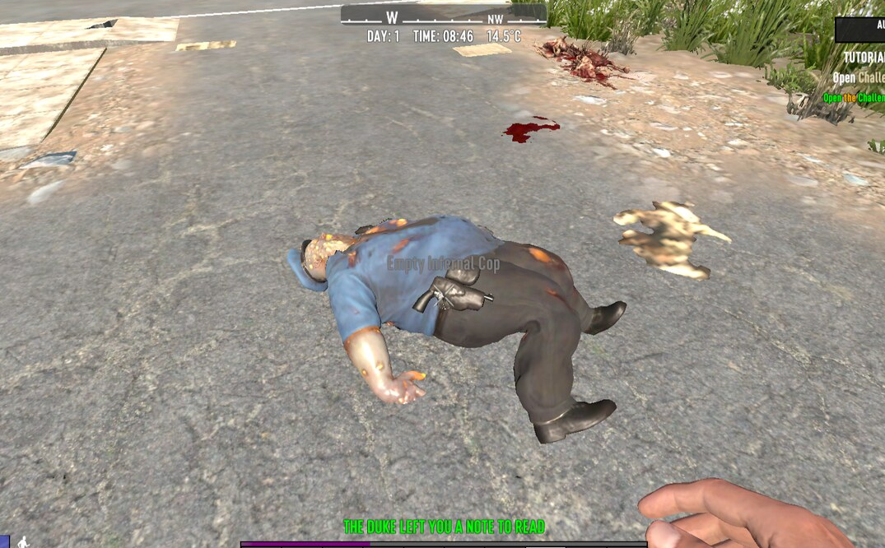
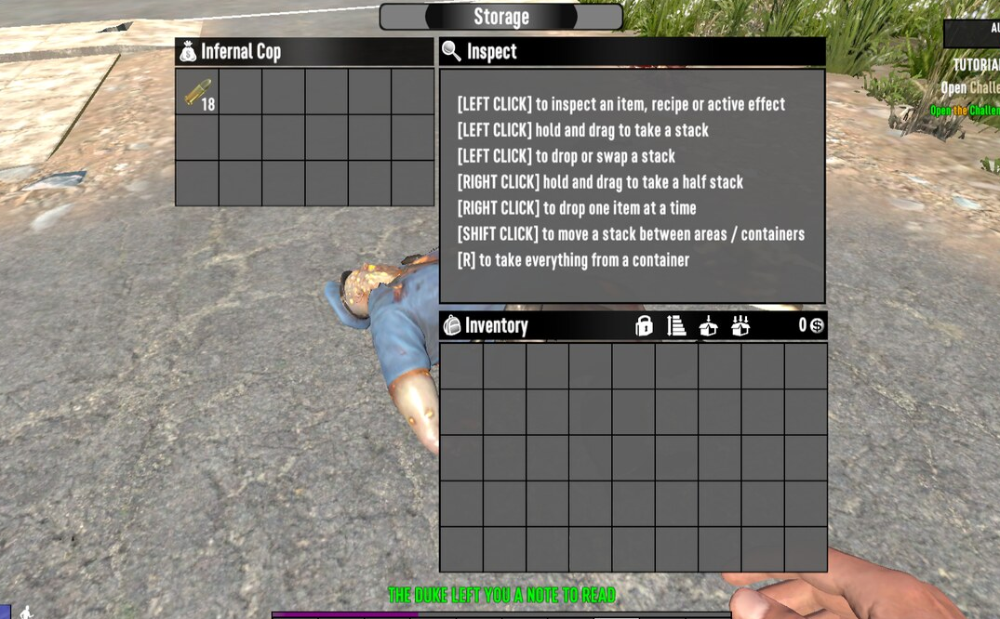

# UndeadLoot Revived

**A 7 Days to Die V3.0 rework of "UndeadLoot" by 7ModsToDead — loot the *actual* bodies of the dead.**

Kill a zombie, walk up to its corpse, and search it like any other container. No decoy
chest, no fake body spawned next to it — you loot the real ragdoll where it fell. Static
corpses lying around in POIs are lootable too.



---

## Why this exists

The original **UndeadLoot** by **7ModsToDead** was a pure-XML mod. In **7 Days to Die V3.0**
the game removed the XML hooks it depended on (`LootListOnDeath`, the old `Loot` block class,
and the corpse-block-on-death system), so the original no longer works. This rework restores
the same experience on V3.0. Because those hooks are gone, making a *real* body lootable now
requires code, so this version ships a small Harmony DLL.

## Features

- **Loot the real defeated body** — press your Use key (E) on a dead zombie to search its
  corpse. It's the actual body, not a spawned block or bag.
- **Color-coded loot prompts, game-wide** — instant state recognition using the colorblind-safe
  [Okabe–Ito palette](https://jfly.uni-koeln.de/color/), applied to **all** containers,
  corpses, doors, workstations, and pickup prompts: 🟢 green = untouched / unlocked, 🟠 orange = opened, ⚪ gray = empty,
  🔴 red = locked, with the 🔵 blue action-key hint (E) on every use prompt. Adds an "Opened" state vanilla lacks and gives locked vs unlocked doors
  distinct colors (vanilla uses the same color for both). Editable in `Config/Localization.csv`.
- **Static POI corpses are lootable.**
- **Every humanoid zombie type & tier** — feral / radiated / **charged** / **infernal**.
- **Per-type loot** — cops/mutated (weapons, ammo), soldiers/demolishers, nurses (medical),
  businessmen (money), hazmat (chemistry), wights (elite), and a balanced generic default.
- **Modded-zombie friendly** — any zombie from another mod is looted automatically (generic
  table, or themed by name, e.g. a modded "…Nurse" gets medical loot).
- Loot respects loot stage / game scaling. Corpses stay harvestable as before.

| Untouched (green) | Opened (orange) | Empty (gray) | Loot the real body |
|---|---|---|---|
|  |  |  |  |

## Requirements

- **7 Days to Die V3.0** (this is a code mod compiled for V3.0; a major game update may need a rebuild).
- **EasyAntiCheat MUST be OFF** — DLL/Harmony mods do not load with EAC on.
- Do not run alongside other mods that recolor loot text (e.g. ColoredLootText) — they fight
  over the same strings. UndeadLoot already does the coloring.

## Installation

1. Download the latest `UndeadLootRevived-vX.Y.Z.zip` from [Releases](../../releases).
2. Extract the `UndeadLoot` folder into `7 Days To Die/Mods/`.
3. Launch the game **with EasyAntiCheat disabled**.
4. Recommended: start on a **new save**.

Multiplayer: install on the **server and every client**, all with EAC off (it patches
client-side interaction/UI, so server-only is not enough).

## Building from source

Requires the .NET SDK. Point the build at your game's `Managed` folder:

```bash
cd src
dotnet build -c Release -p:GameManaged="/path/to/7 Days To Die/7DaysToDie_Data/Managed"
```

The compiled `UndeadLoot.dll` is copied into `../UndeadLoot/`. Zip the `UndeadLoot` folder to package.

## Credits & license

- **Original mod, concept, and loot tables:** [7ModsToDead](https://www.patreon.com/7modstodead)
- **V3.0 rework (code + mechanics):** iotshelnik
- Used and modified under the original's terms — *"free to use and modify, with credit and a
  link to the original source."* See [LICENSE](LICENSE).

## Changelog

### 1.2.0
- The Activate ("Use") key hint — e.g. `(E)` — is now colored sky blue on **every** interaction
  prompt game-wide (workstations, doors, pickups, vehicles, NPCs, dew collectors, containers, and
  more), not just loot prompts. Done at the source via a Harmony patch on the key-binding markup,
  so it also follows your Use-key rebinding. Other key hints (reload, jump, …) are left untouched.

### 1.1.0
- Game-wide color-coded loot prompts (colorblind-safe Okabe–Ito palette; green/orange/gray for
  untouched/opened/empty, distinct red/green for locked/unlocked doors). Editable in
  `Config/Localization.csv`.
- Full humanoid-zombie coverage via keyword detection: every vanilla type and all tiers
  (feral/radiated/charged/infernal), plus automatic handling of modded zombies.
- New themed loot tables for Hazmat and Wight zombies.

### 1.0.0
- Initial release. Rework of UndeadLoot for game V3.0. Real dead bodies lootable via a Harmony
  DLL (the original's XML-only method no longer works on V3.0). Native loot prompt with
  untouched/opened/empty states. Static POI corpses lootable. Per-type loot tables restored.
